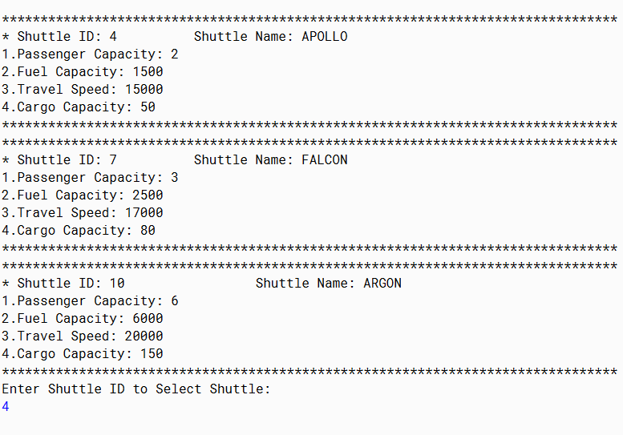
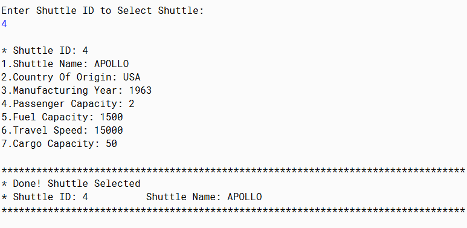

# EmployFast

## General info
EmployFast is a text-based application for the 
Initiate Second Chance Cooperation (ISCC) mission 
to mars project.
	
## Technologies
This application is created with:

##### Programming Language
* Java (Core Java) 

##### IDE requirements - Java
* IntelliJ (recommended)
* NetBeans
* Eclipse

##### Database
After the handover, ISCC will implement its own database. Meanwhile,
you can store data into any of the following files:
* CSV file
* Text file (for example, login.txt)
* Excel file

	
## Setup
To run this project:

1. install it locally by placing the project folder 
   in the directory of your choice.
2. open the project folder.
3. run the `Main.java` file in the root directory.

## Screenshots
* Extracted Shuttle List and information displayed.
 

* Shuttle is selected by entering the Shuttle ID.
* Full information of the selected shuttle displayed 
with a confirmation message. 
